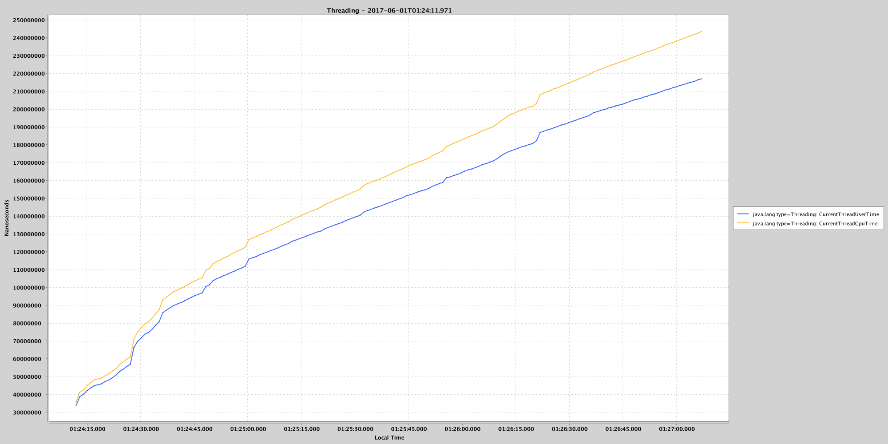
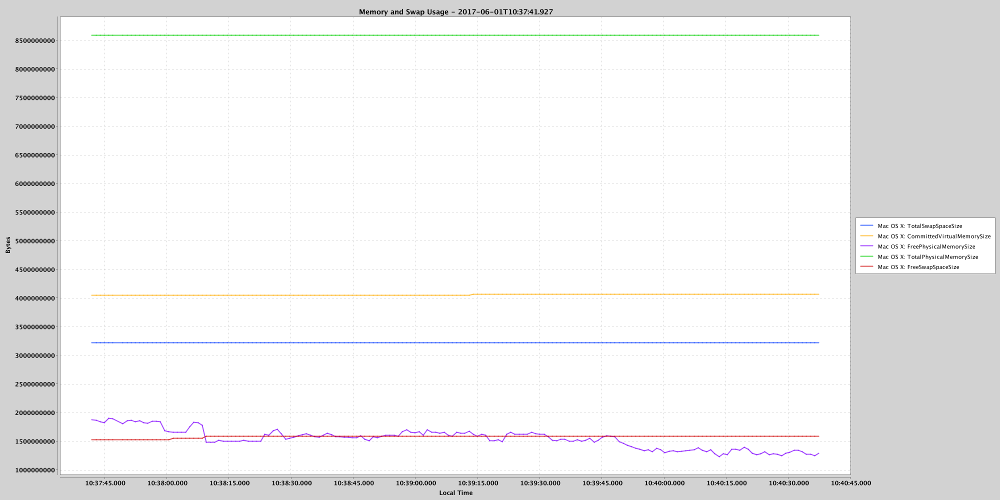

# JMXProfiler

JMXProfiler is a lightweight sampling JVM profiler based on JMX technology.
It gets the values of the attributes of specified MBeans of a Java application and prints them in various formats.

## Distinctive Features

* The printing of MBeans as JSON objects.
* The indexing of MBeans in [Elasticsearch](https://www.elastic.co/products/elasticsearch).
* The plotting of the decimal values of the attributes of MBeans as PNG/GIF/JPG charts via [XChart](https://github.com/timmolter/XChart) library.
* The filtering of the attributes of MBeans via regular expressions.

## Build

Run the Maven command
```
mvn clean package assembly:single
```

## Install

Unpack ```./target/jmxprofiler-<version>-bin.zip``` archive into a suitable directory.

## Run

All parameters of the tools are passed only via command line options.

### Usage

```
java -Dlog4j.configurationFile=./config/log4j2.xml -jar ./lib/jmxprofiler-<version>.jar
    [-a <action name>]
    [-jh <host name>] -jp <port> -jo <object name> [-jif <regex list>] [-jef <regex list>]
    [-tes]
    [-si <msec>] [-fi <msec>] [-d <msec>]
    [-p <printer name>] [-of <file path>]
    [-cw <pixels>] [-ch <pixels>] [-ct <chart title>] [-cxt X axis title] [-cyt Y axis title] [-ctf <time format>]
    [-eh <host name>] [-ep <port>] [-ein <index name>] [-eit <index type>]
```

### Options

* -a, --action <action name>

    An action to execute.

    The default value: profile.

    The available values: profile.
    
* -jh, --jmx-host <host name>
    
    The name of the host of an application to connect via JMX.
    
    The default value: localhost.

* -jp, --jmx-port <port>

    The port of an application to connect via JMX.
    
    This is a required parameter.

* -jo, --jmx-mbean-object-name <object name>

    The object name of an MBean or a pattern that can match the names of several MBeans to profile.

    The default value: null.

    The example: 'java.lang:type=GarbageCollector=,*'.

    See details here:
    * [Java Management Extensions (JMX) - Best Practices - Object Names](http://www.oracle.com/technetwork/java/javase/tech/best-practices-jsp-136021.html?ssSourceSiteId=ocomen#mozTocId509360);
    * [javax.management.ObjectName class](https://docs.oracle.com/javase/8/docs/api/javax/management/ObjectName.html).

* -jif, --jmx-mbean-regex-including-filter <regex list>

    The list of regular expressions of the including filter of the attributes of MBeans.
  
    The default value: null.

* -jef, --jmx-mbean-regex-excluding-filter <regex list>

    The list of regular expressions of the excluding filter of the attributes of MBeans.

    The default value: null.

* -tes, --take-equal-samples

    The profiler will take equal samples if this option is presented.

    The default value: false.

* -si, --sample-interval <msec>

    An interval in milliseconds between profile samples.

    The default value: 1000 msec.

* -fi, --flush-interval <msec>

    An interval in milliseconds of flushing samples into an output file.

    The default value: 0, i.e. flush immediately.

* -d, --duration

    The duration of profiling in milliseconds.

    The default value: 0, i.e the infinite duration.

* -p, --printer <printer name>

    The type of a printer to output samples.

    The default value: json_console.

    The available values:
    * plain_console
    * plain_log
    * json_console
    * json_log
    * elasticsearch
    * png_chart
    * gif_chart
    * jpg_chart

* -o, --output-file <file path>

    The name of an output file for some printers like the chart printers.

* -cw, --chart-width <pixels>

    The width of a chart in pixels.

    The default value: 2000.

* -ch, --chart-height <pixels>

    The height of a chart in pixels.

    The default value: 2000.

* -ct, --chart-title <chart title>

    The title of a chart.

    The default value: a current date time.

* -cxt, --chart-x-axis-title <X axis title>

    The title of X axis of a chart.

    The default value: Local Time.

* -cyt, --chart-y-axis-title <Y axis title>

    The title of Y axis of a chart.

    The default value: Value.

* -cdf, --chart-date-format <time format>

    The format of dates in X axis of a chart.

    See the description of the format here [SimpleDateFormat](https://docs.oracle.com/javase/8/docs/api/java/text/SimpleDateFormat.html)

    The default value: HH:mm:ss.SSS.

* -ccf, --chart-decimal-format <decimal format>

    The format of decimal values in Y axis of a chart.

    See the description of the format here [DecimalFormat](https://docs.oracle.com/javase/8/docs/api/java/text/DecimalFormat.html)

    The default value: #.

* -eh, --elasticsearch-host <host name>

    The name of the host of an Elasticsearch node for the elasticsearch printer.

* -ep, --elasticsearch-port <port>

    The port of an Elasticsearch node.

* -ein, --elasticsearch-index-name <index name>

    The name of an Elasticsearch index.

* -eit, --elasticsearch-index-type <index type>

    The type of an Elasticsearch index.

## Examples

In all examples, the profiler connects to an application that is run on a local host with JMX port 65000.

### Example #1

Print JSON objects that corresponds to [GarbageCollector MBean](https://docs.oracle.com/javase/8/docs/jre/api/management/extension/com/sun/management/GarbageCollectorMXBean.html) objects:
```
java -Dlog4j.configurationFile=./config/log4j2.xml -jar ./lib/jmxprofiler-<version>.jar
--jmx-port=65000
--jmx-mbean-object-name="java.lang:type=GarbageCollector,*"
--printer=json_console
```

There are the following 6 variants of the options of garbage collection algorithms in HotSpot JVM:

| Young Collector                | Old Collector                           | JVM Option(s)                            |
| ------------------------------ | --------------------------------------- | ---------------------------------------- |
| Serial (DefNew)                | Serial Mark-Sweep-Compact               | -XX:+UseSerialGC                         |
| Parallel scavenge (PSYoungGen) | Serial Mark-Sweep-Compact (PSOldGen)    | -XX:+UseParallelGC                       |
| Parallel scavenge (PSYoungGen) | Parallel Mark-Sweep-Compact (ParOldGen) | -XX:+UseParallelOldGC                    |
| Serial (DefNew)                | Concurrent Mark Sweep                   | -XX:+UseConcMarkSweepGC -XX:-UseParNewGC |
| Parallel (ParNew)              | Concurrent Mark Sweep                   | -XX:+UseConcMarkSweepGC -XX:+UseParNewGC |
| G1                             |                                         | -XX:+UseG1GC                             |

The profiler prints the following JSON objects for each garbage collection algorithm:

* Serial (DefNew) - Serial Mark-Sweep-Compact
```
{"Copy":{"timestamp":1496091463194,"LastGcInfo":{"GcThreadCount":1,"duration":3,"endTime":10286,"id":3,"memoryUsageAfterGc":{"Survivor Space":{"key":"Survivor Space","value":{"committed":327680,"init":327680,"max":327680,"used":327680}},"Compressed Class Space":{"key":"Compressed Class Space","value":{"committed":1048576,"init":0,"max":1073741824,"used":977248}},"Eden Space":{"key":"Eden Space","value":{"committed":2818048,"init":2818048,"max":2818048,"used":0}},"Metaspace":{"key":"Metaspace","value":{"committed":8388608,"init":0,"max":-1,"used":8187000}},"Code Cache":{"key":"Code Cache","value":{"committed":2555904,"init":2555904,"max":251658240,"used":1966656}},"Tenured Gen":{"key":"Tenured Gen","value":{"committed":7012352,"init":7012352,"max":7012352,"used":1119664}}},"memoryUsageBeforeGc":{"Survivor Space":{"key":"Survivor Space","value":{"committed":327680,"init":327680,"max":327680,"used":327680}},"Compressed Class Space":{"key":"Compressed Class Space","value":{"committed":1048576,"init":0,"max":1073741824,"used":977248}},"Eden Space":{"key":"Eden Space","value":{"committed":2818048,"init":2818048,"max":2818048,"used":2670992}},"Metaspace":{"key":"Metaspace","value":{"committed":8388608,"init":0,"max":-1,"used":8187000}},"Code Cache":{"key":"Code Cache","value":{"committed":2555904,"init":2555904,"max":251658240,"used":1966656}},"Tenured Gen":{"key":"Tenured Gen","value":{"committed":7012352,"init":7012352,"max":7012352,"used":743704}}},"startTime":10283},"CollectionCount":3,"CollectionTime":8,"Name":"Copy","Valid":true,"MemoryPoolNames":["Eden Space","Survivor Space"],"ObjectName":"java.lang:name=Copy,type=GarbageCollector"}}
{"MarkSweepCompact":{"timestamp":1496091463231,"CollectionCount":0,"CollectionTime":0,"Name":"MarkSweepCompact","Valid":true,"MemoryPoolNames":["Eden Space","Survivor Space","Tenured Gen"],"ObjectName":"java.lang:name=MarkSweepCompact,type=GarbageCollector"}}
```
* Parallel scavenge (PSYoungGen) - Serial Mark-Sweep-Compact (PSOldGen)
```
{"PS MarkSweep":{"timestamp":1496091546118,"CollectionCount":0,"CollectionTime":0,"Name":"PS MarkSweep","Valid":true,"MemoryPoolNames":["PS Eden Space","PS Survivor Space","PS Old Gen"],"ObjectName":"java.lang:name=PS MarkSweep,type=GarbageCollector"}}
{"PS Scavenge":{"timestamp":1496091546133,"LastGcInfo":{"GcThreadCount":8,"duration":2,"endTime":14005,"id":5,"memoryUsageAfterGc":{"Compressed Class Space":{"key":"Compressed Class Space","value":{"committed":1179648,"init":0,"max":1073741824,"used":1046016}},"PS Survivor Space":{"key":"PS Survivor Space","value":{"committed":524288,"init":524288,"max":524288,"used":524288}},"PS Old Gen":{"key":"PS Old Gen","value":{"committed":7340032,"init":7340032,"max":7340032,"used":2272080}},"Metaspace":{"key":"Metaspace","value":{"committed":9043968,"init":0,"max":-1,"used":8628280}},"PS Eden Space":{"key":"PS Eden Space","value":{"committed":2097152,"init":2097152,"max":2097152,"used":0}},"Code Cache":{"key":"Code Cache","value":{"committed":2555904,"init":2555904,"max":251658240,"used":2103488}}},"memoryUsageBeforeGc":{"Compressed Class Space":{"key":"Compressed Class Space","value":{"committed":1179648,"init":0,"max":1073741824,"used":1046016}},"PS Survivor Space":{"key":"PS Survivor Space","value":{"committed":524288,"init":524288,"max":524288,"used":524288}},"PS Old Gen":{"key":"PS Old Gen","value":{"committed":7340032,"init":7340032,"max":7340032,"used":1077360}},"Metaspace":{"key":"Metaspace","value":{"committed":9043968,"init":0,"max":-1,"used":8628280}},"PS Eden Space":{"key":"PS Eden Space","value":{"committed":2097152,"init":2097152,"max":2097152,"used":2097152}},"Code Cache":{"key":"Code Cache","value":{"committed":2555904,"init":2555904,"max":251658240,"used":2103488}}},"startTime":14003},"CollectionCount":5,"CollectionTime":8,"Name":"PS Scavenge","Valid":true,"MemoryPoolNames":["PS Eden Space","PS Survivor Space"],"ObjectName":"java.lang:name=PS Scavenge,type=GarbageCollector"}}
```
* Parallel scavenge (PSYoungGen) - Parallel Mark-Sweep-Compact (ParOldGen)
```
{"PS MarkSweep":{"timestamp":1496091615943,"CollectionCount":0,"CollectionTime":0,"Name":"PS MarkSweep","Valid":true,"MemoryPoolNames":["PS Eden Space","PS Survivor Space","PS Old Gen"],"ObjectName":"java.lang:name=PS MarkSweep,type=GarbageCollector"}}
{"PS Scavenge":{"timestamp":1496091615962,"LastGcInfo":{"GcThreadCount":8,"duration":2,"endTime":13913,"id":5,"memoryUsageAfterGc":{"Compressed Class Space":{"key":"Compressed Class Space","value":{"committed":1179648,"init":0,"max":1073741824,"used":1044752}},"PS Survivor Space":{"key":"PS Survivor Space","value":{"committed":524288,"init":524288,"max":524288,"used":524288}},"PS Old Gen":{"key":"PS Old Gen","value":{"committed":7340032,"init":7340032,"max":7340032,"used":2222912}},"Metaspace":{"key":"Metaspace","value":{"committed":9043968,"init":0,"max":-1,"used":8622744}},"PS Eden Space":{"key":"PS Eden Space","value":{"committed":2097152,"init":2097152,"max":2097152,"used":0}},"Code Cache":{"key":"Code Cache","value":{"committed":2555904,"init":2555904,"max":251658240,"used":2151744}}},"memoryUsageBeforeGc":{"Compressed Class Space":{"key":"Compressed Class Space","value":{"committed":1179648,"init":0,"max":1073741824,"used":1044752}},"PS Survivor Space":{"key":"PS Survivor Space","value":{"committed":524288,"init":524288,"max":524288,"used":524288}},"PS Old Gen":{"key":"PS Old Gen","value":{"committed":7340032,"init":7340032,"max":7340032,"used":1036432}},"Metaspace":{"key":"Metaspace","value":{"committed":9043968,"init":0,"max":-1,"used":8622744}},"PS Eden Space":{"key":"PS Eden Space","value":{"committed":2097152,"init":2097152,"max":2097152,"used":2097152}},"Code Cache":{"key":"Code Cache","value":{"committed":2555904,"init":2555904,"max":251658240,"used":2151744}}},"startTime":13911},"CollectionCount":5,"CollectionTime":8,"Name":"PS Scavenge","Valid":true,"MemoryPoolNames":["PS Eden Space","PS Survivor Space"],"ObjectName":"java.lang:name=PS Scavenge,type=GarbageCollector"}}
```
* Serial (DefNew) - Concurrent Mark Sweep
```
{"ConcurrentMarkSweep":{"timestamp":1496091698875,"CollectionCount":0,"CollectionTime":0,"Name":"ConcurrentMarkSweep","Valid":true,"MemoryPoolNames":["Eden Space","Survivor Space","CMS Old Gen"],"ObjectName":"java.lang:name=ConcurrentMarkSweep,type=GarbageCollector"}}
{"Copy":{"timestamp":1496091698903,"LastGcInfo":{"GcThreadCount":1,"duration":9,"endTime":14488,"id":4,"memoryUsageAfterGc":{"Survivor Space":{"key":"Survivor Space","value":{"committed":327680,"init":327680,"max":327680,"used":327680}},"Compressed Class Space":{"key":"Compressed Class Space","value":{"committed":1179648,"init":0,"max":1073741824,"used":1063832}},"Eden Space":{"key":"Eden Space","value":{"committed":2818048,"init":2818048,"max":2818048,"used":0}},"Metaspace":{"key":"Metaspace","value":{"committed":9043968,"init":0,"max":-1,"used":8782328}},"Code Cache":{"key":"Code Cache","value":{"committed":2555904,"init":2555904,"max":251658240,"used":2211456}},"CMS Old Gen":{"key":"CMS Old Gen","value":{"committed":7012352,"init":7012352,"max":7012352,"used":3123800}}},"memoryUsageBeforeGc":{"Survivor Space":{"key":"Survivor Space","value":{"committed":327680,"init":327680,"max":327680,"used":327680}},"Compressed Class Space":{"key":"Compressed Class Space","value":{"committed":1179648,"init":0,"max":1073741824,"used":1063832}},"Eden Space":{"key":"Eden Space","value":{"committed":2818048,"init":2818048,"max":2818048,"used":2811824}},"Metaspace":{"key":"Metaspace","value":{"committed":9043968,"init":0,"max":-1,"used":8782328}},"Code Cache":{"key":"Code Cache","value":{"committed":2555904,"init":2555904,"max":251658240,"used":2211456}},"CMS Old Gen":{"key":"CMS Old Gen","value":{"committed":7012352,"init":7012352,"max":7012352,"used":1139928}}},"startTime":14479},"CollectionCount":4,"CollectionTime":22,"Name":"Copy","Valid":true,"MemoryPoolNames":["Eden Space","Survivor Space"],"ObjectName":"java.lang:name=Copy,type=GarbageCollector"}}
{"ConcurrentMarkSweep":{"timestamp":1496091712102,"LastGcInfo":{"GcThreadCount":1,"duration":10,"endTime":26707,"id":1,"memoryUsageAfterGc":{"Survivor Space":{"key":"Survivor Space","value":{"committed":327680,"init":327680,"max":327680,"used":327672}},"Compressed Class Space":{"key":"Compressed Class Space","value":{"committed":1179648,"init":0,"max":1073741824,"used":1095928}},"Eden Space":{"key":"Eden Space","value":{"committed":2818048,"init":2818048,"max":2818048,"used":69592}},"Metaspace":{"key":"Metaspace","value":{"committed":9568256,"init":0,"max":-1,"used":9150608}},"Code Cache":{"key":"Code Cache","value":{"committed":2883584,"init":2555904,"max":251658240,"used":2835712}},"CMS Old Gen":{"key":"CMS Old Gen","value":{"committed":7012352,"init":7012352,"max":7012352,"used":2803552}}},"memoryUsageBeforeGc":{"Survivor Space":{"key":"Survivor Space","value":{"committed":327680,"init":327680,"max":327680,"used":327672}},"Compressed Class Space":{"key":"Compressed Class Space","value":{"committed":1179648,"init":0,"max":1073741824,"used":1095928}},"Eden Space":{"key":"Eden Space","value":{"committed":2818048,"init":2818048,"max":2818048,"used":30216}},"Metaspace":{"key":"Metaspace","value":{"committed":9568256,"init":0,"max":-1,"used":9145992}},"Code Cache":{"key":"Code Cache","value":{"committed":2883584,"init":2555904,"max":251658240,"used":2819200}},"CMS Old Gen":{"key":"CMS Old Gen","value":{"committed":7012352,"init":7012352,"max":7012352,"used":4077536}}},"startTime":26697},"CollectionCount":1,"CollectionTime":3,"Name":"ConcurrentMarkSweep","Valid":true,"MemoryPoolNames":["Eden Space","Survivor Space","CMS Old Gen"],"ObjectName":"java.lang:name=ConcurrentMarkSweep,type=GarbageCollector"}}
```
* Parallel (ParNew) - Concurrent Mark Sweep
```
{"ParNew":{"timestamp":1496091872808,"LastGcInfo":{"GcThreadCount":11,"duration":2,"endTime":10298,"id":3,"memoryUsageAfterGc":{"Par Survivor Space":{"key":"Par Survivor Space","value":{"committed":327680,"init":327680,"max":327680,"used":327680}},"Compressed Class Space":{"key":"Compressed Class Space","value":{"committed":1048576,"init":0,"max":1073741824,"used":977248}},"Metaspace":{"key":"Metaspace","value":{"committed":8388608,"init":0,"max":-1,"used":8187664}},"Code Cache":{"key":"Code Cache","value":{"committed":2555904,"init":2555904,"max":251658240,"used":1972928}},"Par Eden Space":{"key":"Par Eden Space","value":{"committed":2818048,"init":2818048,"max":2818048,"used":0}},"CMS Old Gen":{"key":"CMS Old Gen","value":{"committed":7012352,"init":7012352,"max":7012352,"used":1177320}}},"memoryUsageBeforeGc":{"Par Survivor Space":{"key":"Par Survivor Space","value":{"committed":327680,"init":327680,"max":327680,"used":327680}},"Compressed Class Space":{"key":"Compressed Class Space","value":{"committed":1048576,"init":0,"max":1073741824,"used":977248}},"Metaspace":{"key":"Metaspace","value":{"committed":8388608,"init":0,"max":-1,"used":8187664}},"Code Cache":{"key":"Code Cache","value":{"committed":2555904,"init":2555904,"max":251658240,"used":1972928}},"Par Eden Space":{"key":"Par Eden Space","value":{"committed":2818048,"init":2818048,"max":2818048,"used":2677648}},"CMS Old Gen":{"key":"CMS Old Gen","value":{"committed":7012352,"init":7012352,"max":7012352,"used":773512}}},"startTime":10296},"CollectionCount":3,"CollectionTime":7,"Name":"ParNew","MemoryPoolNames":["Par Eden Space","Par Survivor Space"],"Valid":true,"ObjectName":"java.lang:name=ParNew,type=GarbageCollector"}}
{"ConcurrentMarkSweep":{"timestamp":1496091872845,"CollectionCount":0,"CollectionTime":0,"Name":"ConcurrentMarkSweep","MemoryPoolNames":["Par Eden Space","Par Survivor Space","CMS Old Gen"],"Valid":true,"ObjectName":"java.lang:name=ConcurrentMarkSweep,type=GarbageCollector"}}
```
* G1
```
{"G1 Young Generation":{"timestamp":1496092292509,"LastGcInfo":{"GcThreadCount":18,"duration":3,"endTime":10260,"id":1,"memoryUsageAfterGc":{"G1 Survivor Space":{"key":"G1 Survivor Space","value":{"committed":1048576,"init":0,"max":-1,"used":1048576}},"Compressed Class Space":{"key":"Compressed Class Space","value":{"committed":917504,"init":0,"max":1073741824,"used":806776}},"Metaspace":{"key":"Metaspace","value":{"committed":7208960,"init":0,"max":-1,"used":6817480}},"G1 Old Gen":{"key":"G1 Old Gen","value":{"committed":3145728,"init":3145728,"max":10485760,"used":147456}},"G1 Eden Space":{"key":"G1 Eden Space","value":{"committed":6291456,"init":7340032,"max":-1,"used":0}},"Code Cache":{"key":"Code Cache","value":{"committed":2555904,"init":2555904,"max":251658240,"used":1696064}}},"memoryUsageBeforeGc":{"G1 Survivor Space":{"key":"G1 Survivor Space","value":{"committed":0,"init":0,"max":-1,"used":0}},"Compressed Class Space":{"key":"Compressed Class Space","value":{"committed":917504,"init":0,"max":1073741824,"used":806776}},"Metaspace":{"key":"Metaspace","value":{"committed":7208960,"init":0,"max":-1,"used":6817480}},"G1 Old Gen":{"key":"G1 Old Gen","value":{"committed":3145728,"init":3145728,"max":10485760,"used":0}},"G1 Eden Space":{"key":"G1 Eden Space","value":{"committed":7340032,"init":7340032,"max":-1,"used":6291456}},"Code Cache":{"key":"Code Cache","value":{"committed":2555904,"init":2555904,"max":251658240,"used":1696064}}},"startTime":10257},"CollectionCount":1,"CollectionTime":2,"Name":"G1 Young Generation","MemoryPoolNames":["G1 Eden Space","G1 Survivor Space"],"Valid":true,"ObjectName":"java.lang:name=G1 Young Generation,type=GarbageCollector"}}
{"G1 Old Generation":{"timestamp":1496092292546,"CollectionCount":0,"CollectionTime":0,"Name":"G1 Old Generation","MemoryPoolNames":["G1 Eden Space","G1 Survivor Space","G1 Old Gen"],"Valid":true,"ObjectName":"java.lang:name=G1 Old Generation,type=GarbageCollector"}}
```

### Example #2

Plot a PNG chart of the memory usage of all memory pools before and after the start of each garbage collectors
(in bytes,
see [GarbageCollector MBean](https://docs.oracle.com/javase/8/docs/jre/api/management/extension/com/sun/management/GarbageCollectorMXBean.html),
[GcInfo](https://docs.oracle.com/javase/8/docs/jre/api/management/extension/com/sun/management/GcInfo.html),
[MemoryUsage](https://docs.oracle.com/javase/8/docs/api/java/lang/management/MemoryUsage.html)):
```
java -Dlog4j.configurationFile=./config/log4j2.xml -jar ./lib/jmxprofiler-<version>.jar
--jmx-port=65000
--jmx-mbean-object-name="java.lang:type=GarbageCollector,*"
--jmx-mbean-regex-including-filter
"LastGcInfo"
"LastGcInfo/(memoryUsageBeforeGc|memoryUsageAfterGc)"
"LastGcInfo/(memoryUsageBeforeGc|memoryUsageAfterGc)/(Survivor Space|PS Survivor Space|Par Survivor Space|G1 Survivor Space)"
"LastGcInfo/(memoryUsageBeforeGc|memoryUsageAfterGc)/(Eden Space|PS Eden Space|Par Eden Space|G1 Eden Space)"
"LastGcInfo/(memoryUsageBeforeGc|memoryUsageAfterGc)/(Tenured Gen|PS Old Gen|CMS Old Gen|G1 Old Gen)"
"LastGcInfo/(memoryUsageBeforeGc|memoryUsageAfterGc)/(Survivor Space|PS Survivor Space|Par Survivor Space|G1 Survivor Space)/value"
"LastGcInfo/(memoryUsageBeforeGc|memoryUsageAfterGc)/(Eden Space|PS Eden Space|Par Eden Space|G1 Eden Space)/value"
"LastGcInfo/(memoryUsageBeforeGc|memoryUsageAfterGc)/(Tenured Gen|PS Old Gen|CMS Old Gen|G1 Old Gen)/value"
"LastGcInfo/(memoryUsageBeforeGc|memoryUsageAfterGc)/(Survivor Space|PS Survivor Space|Par Survivor Space|G1 Survivor Space)/value/used"
"LastGcInfo/(memoryUsageBeforeGc|memoryUsageAfterGc)/(Eden Space|PS Eden Space|Par Eden Space|G1 Eden Space)/value/used"
"LastGcInfo/(memoryUsageBeforeGc|memoryUsageAfterGc)/(Tenured Gen|PS Old Gen|CMS Old Gen|G1 Old Gen)/value/used"
--duration=180000
--flush-interval=5000
--printer=png_chart
--chart-title="GC Memory Usage"
--chart-y-axis-title="Bytes"
--output-file=./gcLastGcInfoMemoryUsage.png
```


### Example #3

Plot a PNG chart of the elapsed time of each garbage collectors
(in milliseconds,
see [GarbageCollector MBean](https://docs.oracle.com/javase/8/docs/jre/api/management/extension/com/sun/management/GarbageCollectorMXBean.html),
[GcInfo](https://docs.oracle.com/javase/8/docs/jre/api/management/extension/com/sun/management/GcInfo.html)):
```
java -Dlog4j.configurationFile=./config/log4j2.xml -jar ./lib/jmxprofiler-<version>.jar
--jmx-port=65000
--jmx-mbean-object-name="java.lang:type=GarbageCollector,*"
--jmx-mbean-regex-including-filter
"LastGcInfo"
"LastGcInfo/duration"
--duration=180000
--flush-interval=5000
--printer=png_chart
--chart-title="GC Duration"
--chart-y-axis-title="Milliseconds"
--output-file=./gcLastGcInfoDuration.png
```


### Example #4

Plot a PNG chart of the approximate accumulated collection elapsed time
(in milliseconds, see [GarbageCollector MBean](https://docs.oracle.com/javase/8/docs/api/java/lang/management/GarbageCollectorMXBean.html)):
```
java -Dlog4j.configurationFile=./config/log4j2.xml -jar ./lib/jmxprofiler-<version>.jar
--jmx-port=65000
--jmx-mbean-object-name="java.lang:type=GarbageCollector,*"
--jmx-mbean-regex-including-filter
"CollectionTime"
--duration=180000
--flush-interval=5000
--printer=png_chart
--chart-title="GC Collection Time"
--chart-y-axis-title="Milliseconds"
--output-file=./gcCollectionTime.png
```


### Example #5

Plot a PNG chart of the total number of collections that have occurred
(see [GarbageCollector MBean](https://docs.oracle.com/javase/8/docs/api/java/lang/management/GarbageCollectorMXBean.html)):
```
java -Dlog4j.configurationFile=./config/log4j2.xml -jar ./lib/jmxprofiler-<version>.jar
--jmx-port=65000
--jmx-mbean-object-name="java.lang:type=GarbageCollector,*"
--jmx-mbean-regex-including-filter
"CollectionCount"
--duration=180000
--flush-interval=5000
--printer=png_chart
--chart-title="GC Collection Count"
--chart-y-axis-title="Count"
--output-file=./gcCollectionCount.png
```


### Example #6

Plot a PNG chart of the current memory usage of the heap that is used for object allocation and 
non-heap memory that is used by JVM
(in bytes,
see [Memory MBean](https://docs.oracle.com/javase/8/docs/api/java/lang/management/MemoryMXBean.html)):
```
java -Dlog4j.configurationFile=./config/log4j2.xml -jar ./lib/jmxprofiler-<version>.jar
--jmx-port=65000
--jmx-mbean-object-name="java.lang:type=Memory"
--jmx-mbean-regex-including-filter
"HeapMemoryUsage"
"HeapMemoryUsage/committed"
"HeapMemoryUsage/init"
"HeapMemoryUsage/max"
"HeapMemoryUsage/used"
"NonHeapMemoryUsage"
"NonHeapMemoryUsage/committed"
"NonHeapMemoryUsage/init"
"NonHeapMemoryUsage/max"
"NonHeapMemoryUsage/used"
--duration=180000
--flush-interval=5000
--printer=png_chart
--chart-title="Memory"
--chart-y-axis-title="Bytes"
--output-file=./heapAndNonHeapMemoryUsage.png
```


### Example #7

Plot a PNG chart of the approximate number of objects for which finalization is pending
(see [Memory MBean](https://docs.oracle.com/javase/8/docs/api/java/lang/management/MemoryMXBean.html)):
```
java -Dlog4j.configurationFile=./config/log4j2.xml -jar ./lib/jmxprofiler-<version>.jar
--jmx-port=65000
--jmx-mbean-object-name="java.lang:type=Memory"
--jmx-mbean-regex-including-filter
"ObjectPendingFinalizationCount"
--duration=180000
--flush-interval=5000
--printer=png_chart
--chart-title="Object Pending Finalization Count"
--chart-y-axis-title="Count"
--output-file=./objectPendingFinalizationCount.png
```


### Example #8

Plot a PNG chart of the total CPU time of application's threads and
the CPU time that the threads have executed in user mode
(in nanoseconds,
see [Thread MBean](https://docs.oracle.com/javase/8/docs/jre/api/management/extension/com/sun/management/ThreadMXBean.html)):
```
java -Dlog4j.configurationFile=./config/log4j2.xml -jar ./lib/jmxprofiler-<version>.jar
--jmx-port=65000
--jmx-mbean-object-name="java.lang:type=Threading"
--jmx-mbean-regex-including-filter
"CurrentThreadCpuTime"
"CurrentThreadUserTime"
--duration=180000
--flush-interval=5000
--printer=png_chart
--chart-title="Threading"
--chart-y-axis-title="Nanoseconds"
--output-file=./threadTotalAndUserCpuTime.png
```


### Example #9

Plot a PNG chart of the system load average for the last minute
(see [OperatingSystem MBean](https://docs.oracle.com/javase/8/docs/api/java/lang/management/OperatingSystemMXBean.html)):
```
java -Dlog4j.configurationFile=./config/log4j2.xml -jar ./lib/jmxprofiler-<version>.jar
--jmx-port=65000
--jmx-mbean-object-name="java.lang:type=OperatingSystem"
--jmx-mbean-regex-including-filter
"SystemLoadAverage"
--duration=180000
--flush-interval=5000
--printer=png_chart
--chart-title="System Load Average"
--chart-y-axis-title="Rate"
--output-file=./osSystemLoadAverage.png
```


### Example #10

Plot a PNG chart of the "recent cpu usage" for the whole system and the JVM process
(see [OperatingSystem MBean](https://docs.oracle.com/javase/8/docs/jre/api/management/extension/com/sun/management/OperatingSystemMXBean.html)):
```
java -Dlog4j.configurationFile=./config/log4j2.xml -jar ./lib/jmxprofiler-<version>.jar
--jmx-port=65000
--jmx-mbean-object-name="java.lang:type=OperatingSystem"
--jmx-mbean-regex-including-filter
"SystemCpuLoad"
"ProcessCpuLoad"
--duration=180000
--flush-interval=5000
--printer=png_chart
--chart-title="CPU Load"
--chart-y-axis-title="Rate"
--output-file=./osSystemAndProcessCpuLoad.png
```


### Example #11

Plot a PNG chart of the total amount of physical memory, the amount of free physical memory,
the total amount of swap space, the amount of free swap space and
the amount of virtual memory that is guaranteed to be available to the running process
(in bytes,
[OperatingSystem MBean](https://docs.oracle.com/javase/8/docs/jre/api/management/extension/com/sun/management/OperatingSystemMXBean.html)):
```
java -Dlog4j.configurationFile=./config/log4j2.xml -jar ./lib/jmxprofiler-<version>.jar
--jmx-port=65000
--jmx-mbean-object-name="java.lang:type=OperatingSystem"
--jmx-mbean-regex-including-filter
"TotalPhysicalMemorySize"
"FreePhysicalMemorySize"
"TotalSwapSpaceSize"
"FreeSwapSpaceSize"
"CommittedVirtualMemorySize"
--duration=180000
--flush-interval=5000
--printer=png_chart
--chart-title="Memory and Swap Usage"
--chart-y-axis-title="Bytes"
--output-file=./osMemoryAndSwapUsage.png
```


### Example #12

Plot a PNG chart of the number of open file descriptors and the maximum number of file descriptors
(see [UnixOperatingSystem MBean](https://docs.oracle.com/javase/8/docs/jre/api/management/extension/com/sun/management/UnixOperatingSystemMXBean.html)):
```
java -Dlog4j.configurationFile=./config/log4j2.xml -jar ./lib/jmxprofiler-<version>.jar
--jmx-port=65000
--jmx-mbean-object-name="java.lang:type=OperatingSystem"
--jmx-mbean-regex-including-filter
"OpenFileDescriptorCount"
"MaxFileDescriptorCount"
--duration=180000
--flush-interval=5000
--printer=png_chart
--chart-title="File Descriptors"
--chart-y-axis-title="Count"
--output-file=./osFileDescriptorCount.png
```

